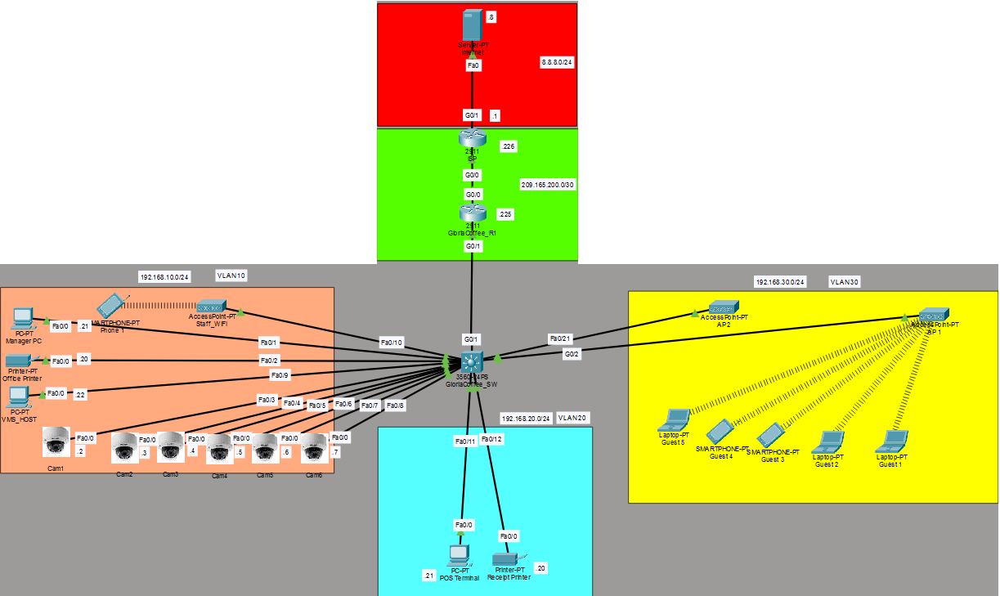

# Gloria Coffee - Secure Enterprise Network Topology


This repository contains a Cisco Packet Tracer project demonstrating a highly secure, segmented, and scalable network topology for a commercial coffee shop (Gloria Coffee). The lab simulates an ISP, a simulated internet environment, a core router, and a core switch managing multiple isolated VLANs.

## 🗺️ Network Topology



## 🏢 VLAN Architecture & Business Logic

The network is segmented into four distinct VLANs (plus a blackhole VLAN) to ensure strict security, compliance, and traffic isolation across the business:

| VLAN ID | Name | Subnet | Gateway | Purpose & Security Focus |
|---------|------|--------|---------|--------------------|
| **10** | MANAGER_OFFICE | `192.168.10.0/24` | `192.168.10.1` | Corporate devices, IP cameras, and VMS Security Server. |
| **20** | POS_SYS | `192.168.20.0/24` | `192.168.20.1` | Point of Sale devices handling transactions (PCI-DSS focused). |
| **30** | GUEST_WIFI | `192.168.30.0/24` | `192.168.30.1` | Public Wi-Fi access with client isolation. |
| **99** | NET_MGMT | `192.168.99.0/24` | `192.168.99.1` | Dedicated management VLAN for SSH access to network infrastructure. |
| **999** | UNUSED_PORTS | N/A | N/A | "Blackhole" VLAN for all administratively shut down ports. |

---

https://github.com/user-attachments/assets/5a86f648-b328-4a40-bc3d-7b65aa5a7a83


## 🖧 Core Switch & L2 Security (GloriaCoffee_SW)

The core switch acts as the primary enforcement point for internal network security, utilizing several Layer 2 hardening techniques to prevent unauthorized access, spoofing, and internal lateral movement.

### Port Security & Access Control
Physical switch ports are strictly controlled based on their intended function:
*   **Wired Corporate Ports:** Ports servicing the management office and POS systems utilize `mac-address sticky` to permanently lock physical wall jacks to specific, authorized corporate devices.
*   **Wireless Access Point Ports:** Switch ports connecting to Guest Wi-Fi APs accommodate transient devices by utilizing a maximum MAC address limit combined with a `restrict` violation mode and a 10-minute aging timer. This prevents MAC flooding attacks while gracefully releasing inactive guest sessions.
*   **Unused Ports:** All inactive ports are administratively shut down and placed into a "blackhole" VLAN (VLAN 999) to prevent unauthorized network access via physical tampering.
*   **Broadcast Control:** Storm control is configured to limit broadcast traffic to 5-10% of interface bandwidth, mitigating potential broadcast storms.

### Layer 2 Hardening
*   **DHCP Snooping & Dynamic ARP Inspection (DAI):** Configured across all active VLANs to establish a trusted DHCP binding database. This prevents rogue DHCP server deployments and mitigates ARP poisoning/Man-in-the-Middle (MitM) attacks.
*   **Spanning Tree Protocol (PVST):** Edge ports are configured with `portfast` for immediate forwarding and `bpduguard` to instantly disable the port if unauthorized switches are connected, preventing bridging loops.

### VLAN-Specific Logic
*   **VLAN 10 (Management Office & Physical Security):** To ensure strict internal host isolation, an inbound Access Control List (ACL 101) restricts lateral communication. The network logic dictates that the Manager PC may only communicate with the office printer, while the Video Management System (VMS) server is strictly limited to communicating with the IP security cameras. Additionally, a strict zero-trust model is applied to IoT devices: the printer, cameras, and VMS host are intentionally air-gapped from the internet to eliminate vectors for external exploitation.
*   **VLAN 20 (Point of Sale Systems):** Designed with Payment Card Industry Data Security Standard (PCI-DSS) compliance in mind, the POS terminals and receipt printers are heavily isolated from both the management and guest networks to secure sensitive transactional data.
*   **VLAN 30 (Guest Wi-Fi Segregation):** Guest traffic is kept entirely separate from corporate infrastructure. To enforce client isolation at the switch level, the switch ports connecting the Access Points are configured as `protected` ports, preventing direct AP-to-AP communication.

### ⚠️ Packet Tracer Limitations (Switching & L2)
*   **VLAN Access Control Lists (VACLs) & Static IPs:** In a production environment, granular host isolation (such as restricting the VMS exclusively to cameras) and complete DAI enforcement would utilize VACLs and MAC-based filtering. Because Packet Tracer lacks VACL support and single-address DHCP reservations, this lab enforces internal isolation using standard IP ACLs tied to statically assigned IP addresses.
*   **Wireless Infrastructure Management:** The simple Access Points in the simulator lack management IP capabilities, preventing them from being placed in a dedicated management VLAN distinct from the guest traffic. Additionally, while `protected` switchports stop AP-to-AP communication, true intra-AP client isolation (preventing clients on the same AP from communicating) is unsupported.
*   **DHCP Lease Timers:** High-turnover networks like Guest Wi-Fi require short DHCP lease timers (e.g., 1-2 hours) to prevent IP address pool exhaustion. Packet Tracer’s DHCP implementation does not support configurable lease durations.
*   **POS Internet Connectivity:** Real-world POS terminals require internet access to reach external payment processing gateways. In a production environment, this is achieved using stateful Next-Generation Firewalls (NGFW) to whitelist specific FQDNs or IPs. Due to the simulator's reliance on stateless ACLs, the POS network in this lab is strictly air-gapped from the WAN.

---

## 🚦 Edge Router & Inter-VLAN Routing (GloriaCoffee_R1)

The edge router serves as the gateway for all internal networks, handling inter-VLAN routing, dynamic IP allocation, NAT, and perimeter defense against external threats.

### Routing & IP Address Management (IPAM)
*   **Router-on-a-Stick (ROAS):** Inter-VLAN routing is facilitated through a single physical Gigabit interface utilizing 802.1Q subinterfaces. This allows isolated broadcast domains to route traffic logically through a central chokepoint.
*   **DHCP Services & Expandability:** The router acts as the centralized DHCP server for the Management, POS, and Guest networks. To accommodate future network expansion and ensure static infrastructure (such as servers, cameras, and printers) have predictable addresses, the first 20-22 IP addresses of each subnet are explicitly excluded from the DHCP pools.

### Perimeter Security & Access Control
*   **WAN Edge Anti-Spoofing:** An inbound Access Control List (`WAN_IN`) is applied to the internet-facing interface. This ACL drops unsolicited ICMP echo requests to maintain a stealth profile and explicitly blocks RFC-1918 private IP addresses from entering the WAN edge, mitigating external IP spoofing attacks.
*   **Secure Infrastructure Management:** Remote administrative access (SSHv2) to the router is strictly controlled via Virtual Terminal (VTY) access classes. Management traffic is isolated and only permitted when originating from the dedicated Network Management VLAN. Console access is protected by local authentication to prevent unauthorized physical tampering.
*   **Inter-VLAN ACLs:** Extended ACLs are applied inbound on the subinterfaces to prevent lateral movement. For example, the Guest and POS networks are strictly denied from routing into the Management office or each other.

https://github.com/user-attachments/assets/925b0f85-d2b3-4fb4-9c66-0813b104ba5a


### Network Address Translation (NAT)
Port Address Translation (PAT / NAT Overload) is configured to map internal private IP addresses to a single public IP provided by the ISP. A standard ACL explicitly dictates which hosts are permitted to be translated:
*   Standard employee and guest devices are permitted outbound translation.
*   Specific IoT and management devices (like the office printer) are explicitly denied NAT translation, enforcing a strict local-only air-gap.

<details>
  <summary>🔍 View NAT & Air-Gap ACL Config</summary>
  ```cisco
  ip nat inside source list 1 interface GigabitEthernet0/0 overload
  
  ! Denying specific IoT and Management devices from NAT translation
  access-list 1 deny host 192.168.10.2
  access-list 1 deny host 192.168.10.20
  access-list 1 deny host 192.168.10.22
  access-list 1 permit 192.168.10.0 0.0.0.255
  access-list 1 permit 192.168.20.0 0.0.0.255
  access-list 1 permit 192.168.30.0 0.0.0.255

### ⚠️ Packet Tracer Limitations (Routing & Edge)
*   **Stateless vs. Stateful Inspection:** In a real-world enterprise, the POS system requires secure outbound internet access to communicate with payment processors, which is best handled by a Next-Generation Firewall (NGFW) performing stateful inspection and URL filtering. Because Packet Tracer relies on basic, stateless ACLs, accurately simulating this granular, secure outbound access without exposing the POS network is highly limited, requiring a total air-gap in this simulation.
*   **VPN and Cryptography:** A standard enterprise deployment would utilize an IPsec or SSL VPN for secure remote management from outside the site. Packet Tracer's implementation of cryptography lacks support for modern, secure cipher suites, so remote VPN access was omitted in favor of local management isolation.

---

## 🌍 ISP & WAN Simulation

The ISP router and internet server emulate external wide-area network (WAN) services, providing upstream routing, time synchronization, and basic web access for client verification.

### Upstream Routing & NAT Realism
*   **Public IP Addressing:** The WAN link between R1 and the ISP utilizes a `/30` public subnet (`209.165.200.224/30`).
*   **Realistic Routing Boundary:** Reflecting real-world ISP operations, the ISP router possesses no routing table entries for internal RFC-1918 subnets. Upstream routing relies entirely on R1 translating internal client addresses to its publicly routable IP before forwarding packets over the transit link.

### Public Services & Testing Infrastructure
*   **Network Time Protocol (NTP):** The ISP router acts as an authoritative stratum-2 NTP master. R1 synchronizes its clock directly with the ISP, and the core switch in turn synchronizes with R1, ensuring consistent log timestamping across the enterprise.
*   **Simulated Internet Server:** Configured with the well-known public address `8.8.8.8` to simulate external internet hosting. 
*   **HTTP/DNS Simulation:** The server runs local web services hosting lightweight mock pages (such as `google.html` and `youtube.html`). When guest or management clients issue web requests or test DNS lookups, the server delivers an in-browser response to verify end-to-end WAN path validation without needing external connectivity.


https://github.com/user-attachments/assets/7fb63aeb-25fb-45a4-9f81-477cad7d6848


### ⚠️ Packet Tracer Limitations (ISP & WAN Services)
*   **Simplified Internet Architecture:** In production, enterprise internet connectivity involves public Autonomous System Numbers (ASNs), Border Gateway Protocol (BGP) peering, and Content Delivery Networks (CDNs). A single mock server and static default route are used here to represent the broader internet within Packet Tracer's simulation limits.
*   **DNS & FQDN Resolvers:** The simulated internet server acts as both the DNS host and web server simultaneously. In enterprise environments, split-horizon DNS, external public DNS resolvers (e.g., Cloudflare, Google), and authoritative web hosting reside on discrete, globally distributed infrastructures.

---

## 🔐 Device Credentials

To explore the configurations directly via the CLI in Cisco Packet Tracer, use the following authentication details. 

| Device | Access Method | Username | Password | Enable Secret |
| :--- | :--- | :--- | :--- | :--- |
| **GloriaCoffee_R1** | Console (CLI Tab) | `r1_console` | `ConsolePass2026!` | `Cisco123` |
| **GloriaCoffee_R1** | SSH (via VLAN 99) | `netadmin` | `StrongPass2026!` | `Cisco123` |
| **GloriaCoffee_SW** | Console (CLI Tab) | `sw_console` | `ConsolePass2026!` | `Cisco123` |
| **GloriaCoffee_SW** | SSH | `admin` | `Cisco123` | `Cisco123` |

### ⚠️ Packet Tracer Limitations (Authentication)
* **Interchangeable Local Accounts:** In this Packet Tracer simulation, the `login local` command allows any user in the local database to log in via either the Console or SSH (VTY lines). In a real-world enterprise deployment using AAA (TACACS+/RADIUS), console administration and remote SSH administration are strictly segregated. An account provisioned specifically for SSH would not be authorized for physical console access, and vice versa.

---

## 🚀 How to Run the Lab

1. **Prerequisites:** Ensure you have **Cisco Packet Tracer** (version 8.0 or newer recommended) installed.
2. **Open the Simulation:** Clone this repository and launch the `.pkt` file located inside the `simulation/` directory.
3. **STP Convergence:** Wait approximately 30–45 seconds for Spanning Tree Protocol (STP) to transition all edge and trunk interfaces from blocking/learning to forwarding (indicated by solid green link lights).
4. **Verification Scenarios:**
   * **Internet Connectivity (Guest / Manager PC):** Open the desktop web browser on `Manager PC` or any device in `GUEST_WIFI` and navigate to `http://8.8.8.8` or enter `http://google.com/google.html ` // ` http://youtube.com/youtube.html `. The mock landing pages should render successfully.
   * **PCI-DSS Compliance Isolation:** Open the command prompt on `POS Terminal` and attempt to ping a guest device (`192.168.30.x`) or the manager PC (`192.168.10.21`). The requests should time out due to the router's inter-VLAN ACLs.
   * **IoT Air-Gap Validation:** Attempt to ping `8.8.8.8` from the `Office Printer` (`192.168.10.20`) or any IP camera. Traffic should be immediately dropped, verifying the local-only enforcement.
